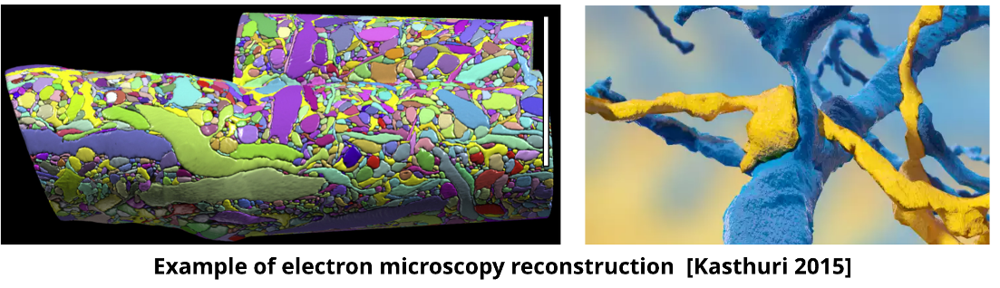

# WELCOME TO THE KASTHURI CHALLLENGE!

Inspired by the MTNeuro Benchmark Dataset found [here](https://github.com/MTNeuro/MTNeuro), the Kasthuri Challenge introduces new annotations of synapses and membranes of neural tissue from a mouse cortex. [BossBD](https://bossdb.org/project/kasthuri2015), an open source volumetric database for 3D and 4D neuroscience data and Neuroglancer were used to derive annotations from the dataset.  

## Links
* [Bossdb Page](https://bossdb.org/project/kasthuri2015)

## Background
 In the past decade, there have been major pursuits in understanding large scale neuroanatomical structures in the brain. With such ventures, there has been a surplus amount of brain data that can potentially reveal different phenomenons about brain organization. Currently, many machine and deep learning tools are being pursued, however there is still a need for new standards for understanding these large scale brain datasets. To access this challenge, we introduce a new dataset, annotations, and tasks that provide a diverse approach to readout information about brain structure and architecture. We adapted a previous multitask neuroimaging benchmark (MTNeuro) of a volumetric, micrometer-resolution X-ray microtomography image spanning a large thalamocortical section of a mouse brain as a baseline for our challenge. Our new standardized challenge (Kasthuri Challenge) aims to generate annotations of a saturated reconstruction of a sub-volume of mouse neocortex imaged with a scanning electron microscope. Specifically, annotations of synapses and membranes are the regions of interest as they provide the best results and insights of how machine and deep learning are able pinpoint the unique connectivity at the microstructure level. Datasets, code, and pre-trained baseline models are provided at: TBD

## Dataset Description
### Kasthuri et. al. 2015 - Mouse Cortex Microstructure
The dataset contains high-resolution images from the mouse cortex acquired with a spatial resolution of 3x3x30 cubic nanometers. The total size of the dataset amounts to a whopping 660GB of images.

<br>


<br>


This volumetric dataset provides detailed reconstructions of a sub-volume of mouse neocortex, encompassing all cellular objects like axons, dendrites, and glia, as well as numerous sub-cellular components. Notable among these are synapses, synaptic vesicles, spines, spine apparati, postsynaptic densities, and mitochondria.

<br>


<br>


<br>

### Exploration and Insights
By leveraging this dataset, the research team made significant discoveries into the structural intricacies of neural tissue at nanometer resolution. A key revelation was the refutation of Peters’ rule. This was achieved by tracing the pathways of all excitatory axons and examining their juxtapositions with every dendritic spine, thereby dispelling the notion that simple physical proximity suffices to predict synaptic connectivity. 

The dataset and its associated labels are hosted publicly on BossDB. To access the data, you can utilize the Python API library, Intern. For anonymous read-only access, use the username "public-access" and password "public".

> More details can be found in the [cited paper](#citation) below.

## Challenge Tasks

Kasthuri Challenge aims to generate annotations of a saturated reconstruction of a sub-volume of mouse neocortex imaged with a scanning electron microscope. Specifically, annotations of synapses and membranes are the regions of interest as they provide the best results and insights of how machine and deep learning are able pinpoint the unique connectivity at the microstructure level. 

<div style="display: flex; justify-content: center; align-items: center;">
    
    
</div>

<br>

<div style="display: flex; justify-content: center; align-items: center;">
    
    
</div>


## Getting Started
### Installation
To get started, clone this repository, change into the directory 

### **1. Create a virtual environment:**

Run the following command to create a virtual environment named **`kasthuri_env`**:

```bash
python3 -m venv kasthuri_env
```

Activate the virtual environment:

```bash
source kasthuri_env/bin/activate
```

### **2. Installing the Packages:**


Now, navigate to the directory where you have cloned the Kasthuri repository and run:

```bash
pip3 install -e ./
```

```bash
pip3 install -r requirements.txt
```

The code has been tested with
* Python >= 3.8
* PIP == 22.1.2
* torch == 1.11.0
* torchvision == 0.12.0
* numpy == 1.19.3

### 3. Installing with GPU Support (Optional)
For users with a compatible NVIDIA GPU, you can leverage accelerated training and inference using PyTorch on CUDA. Follow these steps for a seamless GPU setup:

#### a. Prerequisite GPU Libraries
* **Install NVIDIA CUDA Toolkit 11.6:**  
Before proceeding with PyTorch installation, ensure the NVIDIA CUDA Toolkit 11.6 is set up on your system. [Follow the official guide](https://developer.nvidia.com/cuda-toolkit) to install the correct version.

* **Install NVIDIA cuDNN compatible with CUDA 11.6:**  
After setting up CUDA, install cuDNN, NVIDIA's GPU-accelerated library for deep neural networks. [Find the installation steps in the official NVIDIA documentation](https://developer.nvidia.com/cudnn).

#### b. Modify setup.py
1. Open [`setup.py`](setup.py).
2. Look for the `install_requires` section.
3. Comment out or remove the existing `torch` line.
4. Add the specific version of torch for GPU support:
    ```makefile
    torch==1.11.0+cu116
    ```

#### c. Install Kasthuri Repository and Dependencies
1. Navigate to the directory where you have cloned the Kasthuri repository.
2. Install the Kasthuri package:
    ```bash
    pip3 install -e ./
    ```
3. Install the dependencies in `requirements.txt`:
    ```bash
    pip3 install -r requirements.txt
    ```

#### e. Verify GPU Support
After installation, verify if PyTorch recognizes your GPU:

```python
import torch
print(torch.cuda.is_available())
```


## Code structure
* [`kasthuri`](kasthuri/) - main code folder
    * [`bossdbdataset.py`](kasthuri/bossdbdataset.py) - Pytorch dataset
    * [`networkconfig`](kasthuri/networkconfig/) - JSON configurations for individual network runs
    * [`taskconfig`](kasthuri/taskconfig/) - JSON configurations for membrane and synapse tasks
* [`notebooks`](Notebooks/) - visualization and download notebooks
* [`scripts`](scripts/) - main execution scripts for each task


## Training Scripts
Code for executing training and evaluation for baseline networks are provided for each task in the [`scripts`](scripts/) folder. 

These can all be run as `scripts\script_name` from the main repository folder.

These can be reconfigured for different networks using the configuration files in [`networkconfig`](kasthuri/networkconfig/).

This is the easiest way to build on the example code for network development. A pytorch dataset is provided [bossdbdataloader](kasthuri/bossdbdataset.py) and used in our example [scripts](scripts/).

Instructions for adapting our test scripts for a new model are found in [here](docs/testing_model.md).


To get started running examples, files in the scripts directory can be run following this example
```
python3 scripts/task_membrane.py
```
or
```
python3 scripts/task_synapse.py
```

### Available Network Configurations

Within the [`networkconfig`](kasthuri/networkconfig/) directory, you can find the following configuration files:

- [`UNet_2D.json`](kasthuri/networkconfig/UNet_2D.json) 
- [`UNet_2D_attention.json`](kasthuri/networkconfig/UNet_2D_attention.json) - - attention mechanisms to focus on specific regions of interest.
- [`UNet_2D_depth.json`](kasthuri/networkconfig/UNet_2D_depth.json) - increased model depth capturing complex patterns in the data.
- [`UNet_2D_residual.json`](kasthuri/networkconfig/UNet_2D_residual.json) - residual connections to mitigate the vanishing gradient problem and enhance feature propagation.

You can select any of these configurations using the `--network` argument when running the scripts.


To specify a different network configuration, use the `--network` argument like so:

```
python3 scripts/task_membrane.py --network UNet_2D_attention.json
```

```
python3 scripts/task_synapse.py --network UNet_2D_attention.json
```


and will load default configuration scripts and public authentication credentials. The training script will output trained network weights as a 'pt' file, and produce output figures. 

## Access with Jupyter Notebook
Access [notebooks](notebooks/) notebooks for each task and run cell by cell. The code, by default, saves the cutouts as numpy tensors. 

- `/Notebooks`
  - [`getting_started-Membranes.ipynb`](Notebooks/getting_started-Membranes.ipynb)
  - [`getting_started-Synapses.ipynb`](Notebooks/getting_started-Synapses.ipynb)

Pretained Notebooks are used for inferencing using our pretrained model for each model variation. Install AWS CLI to download pretrained model weights.

- `/Notebooks`
  - [`pretrained-Membranes.ipynb`](Notebooks/pretrained-Membranes.ipynb)
  - [`pretrained-Synapses.ipynb`](Notebooks/pretrained-Synapses.ipynb)

## Citation
If you find this project useful in your research, please cite the following paper!

* [Kasthuri N, Hayworth KJ, Berger DR, Schalek RL, Conchello JA, Knowles-Barley S, Lee D, Vázquez-Reina A, Kaynig V, Jones TR, Roberts M, Morgan JL, Tapia JC, Seung HS, Roncal WG, Vogelstein JT, Burns R, Sussman DL, Priebe CE, Pfister H, Lichtman JW. Saturated Reconstruction of a Volume of Neocortex. Cell. 2015 Jul 30;162(3):648-61.](https://www.sciencedirect.com/science/article/pii/S0092867415008247) doi: 10.1016/j.cell.2015.06.054. PMID: 26232230.

## Contributions
Thank you to the Benchmark Team - Travis Latchman, Tanvir Grewal, Ashley Pattammady, Kim Barrios, Erik Johnson, and the MTNeuro team!

## The Boss Legal Notes
Use or redistribution of the Boss system in source and/or binary forms, with or without modification, are permitted provided that the following conditions are met:

1. Redistributions of source code or binary forms must adhere to the terms and conditions of any applicable software licenses.
2. End-user documentation or notices, whether included as part of a redistribution or disseminated as part of a legal or scientific disclosure (e.g. publication) or advertisement, must include the following acknowledgement: The Boss software system was designed and developed by the Johns Hopkins University Applied Physics Laboratory (JHU/APL).
3. The names "The Boss", "JHU/APL", "Johns Hopkins University", "Applied Physics Laboratory", "MICrONS", or "IARPA" must not be used to endorse or promote products derived from this software without prior written permission. For written permission, please contact BossAdmin@jhuapl.edu.
4. This source code and library is distributed in the hope that it will be useful, but is provided without any warranty of any kind.
